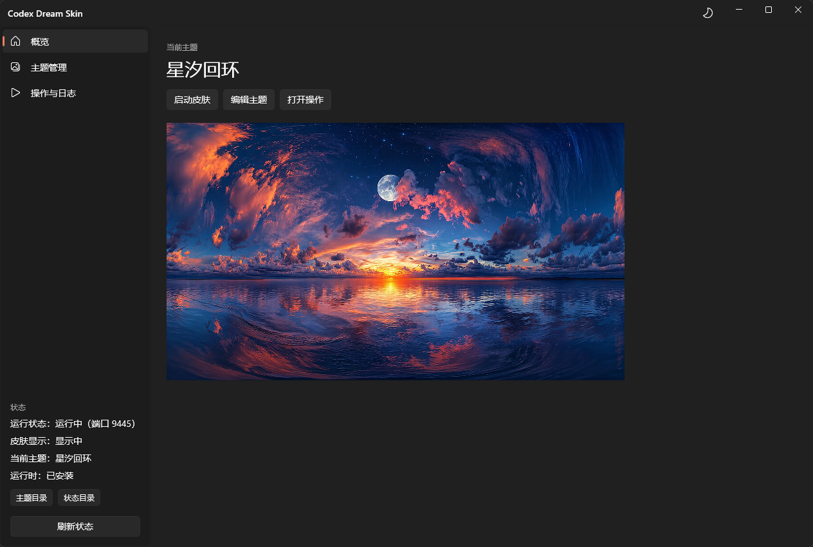
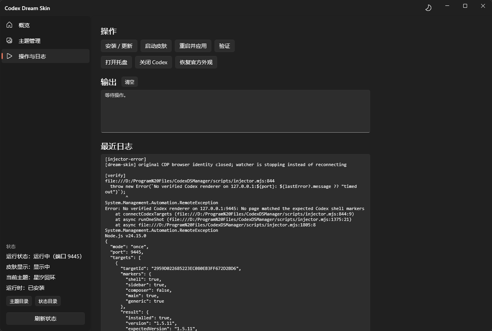

# Codex Dream Skin Manager

> 给 OpenAI Codex 桌面应用换肤的 Windows 管理器 

一个轻量的 Windows 桌面工具，用来给 [Codex](https://openai.com/codex)（OpenAI 的编程助手桌面应用）注入自定义皮肤：换背景图、改配色、定制顶栏/输入框样式，让工作台变成你想要的样子。

## 📸 预览

<p align="center">
  
</p>
<p align="center">
  
</p>
<p align="center">
  
</p>

## ✨ 功能特性

- **概览**：一键启动皮肤，查看/切换当前主题，实时背景预览
- **主题管理**：
  - 主题库：保存、切换、编辑、删除，支持**拖拽排序**
  - 主题编辑器：15 项可调 —— 名称、副标题、标语、项目前缀/标签、状态/引用文案、外观（明暗）、安全区、任务页模式、任务/主页背景透明度、强调色、焦点 X/Y
- **操作与日志**：安装更新、启动皮肤、重启应用、验证、打开托盘、关闭 Codex、恢复官方外观，附脚本输出与注入日志
- **界面体验**：深色/浅色主题一键切换、窗口居中、导航栏宽度可拖拽调整，偏好自动记忆

## 🖥 环境要求

| 项 | 要求 |
|----|------|
| 系统 | Windows 10 (1809+) / Windows 11 |
| 目标应用 | [OpenAI Codex](https://openai.com/codex) 桌面应用（Microsoft Store 版） |
| 运行时 | [.NET 8 Desktop Runtime](https://dotnet.microsoft.com/download/dotnet/8.0)（x64） |

> 应用已自带 Windows App SDK runtime，无需单独安装。

## 🚀 零基础使用（无需任何技术知识）

### 第一次使用（3 步搞定）

1. **装 Codex**：从 Microsoft Store 安装 [OpenAI Codex](https://openai.com/codex)（如果还没装）
2. **下载本工具**：下载发布包（zip），解压，双击 `CodexDreamSkinManager.exe`
3. **点「安装 / 更新」**：左侧 **「操作与日志」** 页 → 点 **「安装 / 更新」**，把皮肤引擎部署到本机。首次使用必做一次，之后不用再点

### 日常使用

- 点 **「启动皮肤」**：自动打开 Codex 并套上皮肤
- 去 **「主题管理」**：选背景图、调颜色/位置，点「保存」
- 不想用了点 **「恢复官方外观」**：一键还原成 Codex 原样

### 「安装 / 更新」是什么？会不会联网下载？

**不会联网下载内核。**

「安装 / 更新」只做**本地部署**：把随本工具一起分发的皮肤引擎（PowerShell 脚本 + 资源）复制到本机 `%LOCALAPPDATA%\CodexDreamSkin`、配置 Codex、并创建桌面/开始菜单快捷方式。整个过程离线完成。

想要更新内核版本，去原项目[GitHub Releases](https://github.com/Fei-Away/Codex-Dream-Skin/releases) 手动下载新版替换引擎文件即可。

### 各页说明

- **概览**：看当前主题和背景，快速「选择背景图 / 暂停皮肤 / 保存当前主题」
- **主题管理**：左侧是主题库（拖拽排序），右侧是编辑器（改完点「保存」或「另存主题」）
- **操作与日志**：安装 / 启动 / 重启 / 验证 / 恢复等操作，以及脚本输出和注入日志

## 🛠 从源码编译

### 前置

- Visual Studio 2022+（勾选「.NET 桌面开发」工作负载）
- .NET 8 SDK

### 引擎（已内置）

皮肤引擎已随本仓库打包在 `engine/` 子目录（`engine/scripts`、`engine/assets`、`engine/VERSION`），编译时自动复制进输出目录。**仓库自包含，clone 后即可编译，无需额外获取引擎。**

### 编译步骤

1. 用 VS 打开 `CodexDreamSkinManager.csproj`（或 `.slnx`）
2. 配置选 **x64 + Release**
3. 生成（Build）
4. 输出在 `bin/x64/Release/net8.0-windows10.0.19041.0/win-x64/`，直接运行 `CodexDreamSkinManager.exe`

## 🧱 技术架构

```
┌─────────────────────────┐
│  WinUI 3 GUI (C#)       │  本仓库
│  调 powershell.exe       │
└───────────┬─────────────┘
            │ 子进程调用 + 读状态文件
┌───────────▼─────────────┐
│  皮肤引擎（不在本仓库）    │
│  PowerShell 脚本 +        │  安装/启动/恢复/验证
│  Node injector (CDP:9445) │  向 Codex 注入 CSS
└─────────────────────────┘
```

- GUI 只是「操作壳」，真正的皮肤注入由 PowerShell 脚本 + Node injector 完成
- 端口固定 `9445`（Codex 的 CDP 调试端口）
- 引擎版本：`1.5.11`

## 📁 目录结构

```
windows/winui/
├── CodexDreamSkinManager.csproj   # 项目（net8.0-windows + WinAppSDK + self-contained）
├── CodexDreamSkinManager.slnx
├── app.manifest
├── App.xaml / App.xaml.cs          # 应用入口 + 服务初始化
├── MainWindow.xaml / .cs           # 主窗口（NavigationView 三页 + 标题栏 + 主题/宽度记忆）
├── engine/                         # 皮肤引擎（已内置，随仓库分发）
│   ├── scripts/                    #   PowerShell + injector
│   ├── assets/                     #   CSS / 图片 / selectors
│   └── VERSION
├── Assets/                         # 图标
├── Converters/                     # 值转换器
├── Models/                         # 主题 / 状态模型
├── Services/
│   ├── PowerShellRunner.cs         # 调 powershell.exe 执行引擎脚本
│   ├── StatusReader.cs             # 读 state.json / 主题 / 日志
│   ├── ThemeService.cs             # 主题 CRUD（含热应用）
│   ├── ThemeSerializer.cs          # 主题规范化
│   └── FileDialogService.cs        # 选图 / 打开文件夹
└── Views/
    ├── OverviewPage.xaml/.cs
    ├── ThemesPage.xaml/.cs
    └── ActionsPage.xaml/.cs
```

## ⚙️ 配置持久化

- 界面偏好：`%LOCALAPPDATA%\CodexDreamSkinManager\settings.json`（主题模式、导航栏宽度）
- 主题排序：`%LOCALAPPDATA%\CodexDreamSkin\gui-theme-order.json`

## 🙏 致谢

本项目是 [Codex Dream Skin](https://github.com/Fei-Away/Codex-Dream-Skin) 的 WinUI 3 版，图形操作更方便。皮肤引擎沿用原项目的 PowerShell + Node injector 方案。

## 📄 License

本项目使用 [MIT License](LICENSE)。
